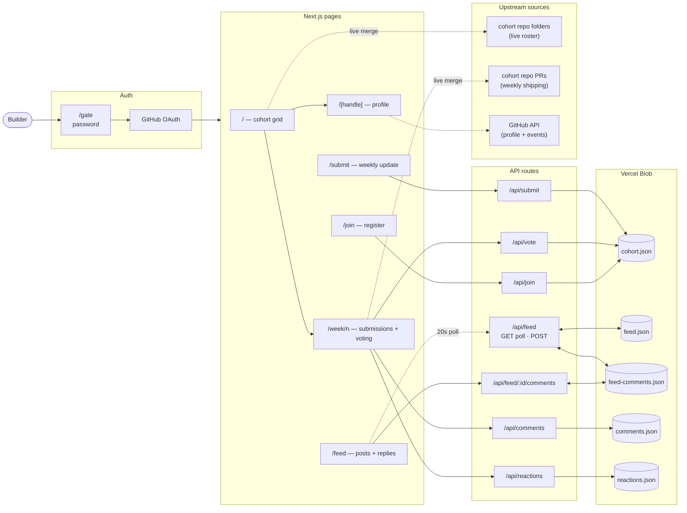

# Launchpad

Peer discovery PM tool for Cursor Boston Cohort 1. 100 builders, 6 weeks, shipping from Boston.

Browse what everyone's building, submit weekly updates with Loom videos, vote for the best builds on Friday.

## How it works



## Features

- **Cohort feed** (`/`) — searchable grid of every member, sorted by who shipped most recently. Green border = shipped this week.
- **Live roster sync** — the member list is fetched from `pydata-2026-submissions/` subdirectories in the upstream [`rogerSuperBuilderAlpha/cursor-boston`](https://github.com/rogerSuperBuilderAlpha/cursor-boston) repo on each page load (ISR-cached 1 hr). Manual project metadata in `cohort.json` is preserved for matching handles.
- **Live PR shipping tracker** — weekly views surface submissions from upstream PRs even when the author hasn't filled out the in-app form. PR status (open / merged) shown as a badge.
- **Profile pages** (`/[handle]`) — GitHub data merged with project info, shipping log with embedded Loom videos, stats row, humanized GitHub activity.
- **Weekly views** (`/week/1` – `/week/6`) — full 6-week curriculum with submissions, Loom embeds, deploy links, voting, and leaderboard.
- **Social feed** (`/feed`) — short-form posts from cohort members with threaded replies, author hover cards (bio, location, currently-building, flair), and rich link chips (favicon + host + path). Auto-polls every 20s, sticky composer with ⌘+Enter shortcut, auto-grow textarea, char counter, link validation. Posts rate-limited (1 / 10s, 20 / 24h per author); comments rate-limited (1 / 10s, 60 / 24h). Delete your own posts and comments. Hover for absolute timestamp.
- **Self-registration** (`/join`) — fill out a form with a PIN, instantly appear on the feed.
- **Weekly submissions** (`/submit`) — sign in once, then submit what you shipped, Loom URL, and deploy URL.
- **Voting** — one vote per member per week. Sign in, click "Vote" on any submission. Leaderboard updates live.
- **Cohort gate** (`/gate`) — password-protected entry; full lockout when signed out.
- **GitHub sign-in** — NextAuth v5 + GitHub OAuth. Required to view content.
- **PIN security** — salted SHA-256 hashed PINs for write actions.
- **Loom embeds** — Loom share URLs auto-embed as 16:9 video players on profiles and weekly views.
- **Boston time everywhere** — all user-facing timestamps are pinned to `America/New_York` so server-rendered (UTC) and client output match.

## 6-Week Curriculum

| Week | Theme | Format |
|------|-------|--------|
| 1 | Project Management Build | Vote to win |
| 2 | Communications Build | Vote to win |
| 3 | Vibe Marketing Build | Vote to win |
| 4 | Ludwitt Education Tool | Merge to ship |
| 5 | Your Own Startup | Show & tell |
| 6 | Open-Source PR | Demo day |

## Stack

- Next.js 16 (App Router, TypeScript, `src/` directory, Turbopack)
- React 19
- NextAuth.js v5 (GitHub OAuth)
- Tailwind CSS v4 + shadcn/ui
- Sora + JetBrains Mono fonts
- Vercel Blob for persistence (falls back to local JSON in dev)
- Vercel Analytics
- GitHub API for profile data + live cohort roster
- Zod for runtime validation
- npm

## Getting started

```bash
npm install
npm run dev
```

Open [http://localhost:3000](http://localhost:3000).

### Environment variables

Create `.env.local`:

```
AUTH_URL=http://localhost:3000
AUTH_SECRET=<openssl rand -base64 32>
AUTH_GITHUB_ID=<dev OAuth App client ID>
AUTH_GITHUB_SECRET=<dev OAuth App client secret>
COHORT_PASSWORD=<gate password>
# Optional — raises GitHub rate limit from 60/hr to 5,000/hr
GITHUB_TOKEN=<fine-grained PAT, public_repo read>
# Optional — enables Blob persistence for writes
BLOB_READ_WRITE_TOKEN=<from Vercel Blob>
```

Create two GitHub OAuth Apps at https://github.com/settings/developers — one for local (`http://localhost:3000/api/auth/callback/github`) and one for production (`https://<your-domain>/api/auth/callback/github`). A single OAuth App supports only one callback URL.

Without `BLOB_READ_WRITE_TOKEN`, the app reads from `src/data/cohort.json`. Write endpoints (`/api/join`, `/api/submit`, `/api/vote`) require the token.

## Deploy to Vercel

1. Push to GitHub
2. Import the repo at [vercel.com/new](https://vercel.com/new)
3. Add a Blob Store: project dashboard → Storage → Create → Blob (sets `BLOB_READ_WRITE_TOKEN` automatically)
4. Set env vars in Vercel dashboard: `AUTH_URL` (your prod URL), `AUTH_SECRET`, `AUTH_GITHUB_ID`, `AUTH_GITHUB_SECRET`, `COHORT_PASSWORD`, optionally `GITHUB_TOKEN`
5. Deploy

## API

### `POST /api/join` — Register

```json
{
  "handle": "your-github-username",
  "projectName": "My Project",
  "projectDescription": "One-line description",
  "projectUrl": "https://my-app.vercel.app",
  "repoUrl": "https://github.com/you/repo",
  "tags": ["devtools", "ai"],
  "pin": "your-secret-pin"
}
```

### `POST /api/submit` — Weekly update

```json
{
  "handle": "your-github-username",
  "pin": "your-secret-pin",
  "week": 1,
  "shipped": "Built the cohort feed and profile pages.",
  "loomUrl": "https://www.loom.com/share/abc123",
  "deployUrl": "https://my-app.vercel.app"
}
```

### `POST /api/vote` — Cast a vote

```json
{
  "voter": "your-github-username",
  "pin": "your-secret-pin",
  "week": 1,
  "candidate": "other-members-handle"
}
```

One vote per member per week. You can change your vote. Can't vote for yourself.

### `GET /api/feed` — List feed posts

Returns `{ posts: FeedPost[], commentCounts: Record<postId, number> }`, newest first. Sent with `Cache-Control: no-store`; the client polls this every 20s.

### `POST /api/feed` — Create a feed post

Requires GitHub sign-in. Author must be a cohort member.

```json
{
  "text": "Shipped the v1 today.",
  "link": "https://my-app.vercel.app"
}
```

Rate-limited per author: **1 post / 10s** (burst) and **20 posts / 24h**. Returns `429` with a `Retry-After` header when over the limit.

### `DELETE /api/feed/[id]` — Delete your own feed post

Requires GitHub sign-in. `403` if the post is not yours; `404` if it does not exist.

### `GET /api/feed/[id]/comments` — List replies on a post

Returns `{ comments: FeedComment[] }` ordered oldest-first. Fetched lazily when a reply thread is expanded.

### `POST /api/feed/[id]/comments` — Reply to a feed post

Requires GitHub sign-in. Author must be a cohort member. Body: `{ "text": "Nice ship!" }` (1–500 chars). Rate-limited per author: **1 comment / 10s** (burst), **60 / 24h**. Returns `429` with `Retry-After` when over the limit.

### `DELETE /api/feed/[id]/comments/[commentId]` — Delete your own reply

Requires GitHub sign-in. `403` if the comment is not yours; `404` if it does not exist.

## Project structure

```
src/
  app/
    page.tsx                 # Cohort feed
    [handle]/page.tsx        # Profile page
    week/[n]/page.tsx        # Weekly view + voting
    join/page.tsx            # Registration form
    submit/page.tsx          # Weekly update form
    gate/page.tsx            # Cohort password gate
    api/
      auth/[...nextauth]/    # NextAuth handler
      gate/route.ts          # Cohort password check
      signout/route.ts       # Sign-out endpoint
      join/route.ts          # Registration endpoint
      submit/route.ts        # Submission endpoint
      vote/route.ts          # Voting endpoint
      reactions/route.ts     # Emoji reactions
      comments/route.ts      # Comments
      feed/route.ts                          # Feed: GET (poll) + POST (rate-limited)
      feed/[id]/route.ts                     # Feed: DELETE own post
      feed/[id]/comments/route.ts            # Feed comments: GET + POST (rate-limited)
      feed/[id]/comments/[commentId]/route.ts # Feed comments: DELETE own reply
  auth.ts                    # NextAuth config (GitHub provider)
  components/
    session-provider.tsx     # NextAuth client wrapper
    identity-context.tsx     # Client-side identity (handle + PIN)
    identity-bar.tsx         # Sign-in bar
    vote-button.tsx          # One-click voting
    submit-form.tsx          # Weekly update form
    join-form.tsx            # Registration form
    member-card.tsx          # Member card
    member-grid.tsx          # Searchable grid
    loom-embed.tsx           # Loom video embed
    nav-header.tsx           # Navigation
    feed-board.tsx           # Feed list + composer (sticky, auto-grow, ⌘+Enter)
    feed-thread.tsx          # Inline reply thread per post
    author-hover-card.tsx    # Hover preview: bio, location, building, flair
    footer.tsx               # Footer
  data/
    cohort.json              # Seed data + manual project metadata
    weeks.ts                 # 6-week curriculum
  lib/
    data.ts                  # Data access (merges live GitHub roster + Blob/JSON, synthesizes PR-only submissions)
    cohort-source.ts         # Live cohort roster fetcher (upstream repo)
    pr-source.ts             # Live upstream PR fetcher per week
    github.ts                # GitHub user/events fetcher
    types.ts                 # Zod schemas
    events.ts                # GitHub event humanizer
    pin.ts                   # PIN hashing + verification
    week.ts                  # Week utilities
    utils.ts                 # cn(), relativeTime(), absoluteTime() (cohort-TZ pinned)
```
